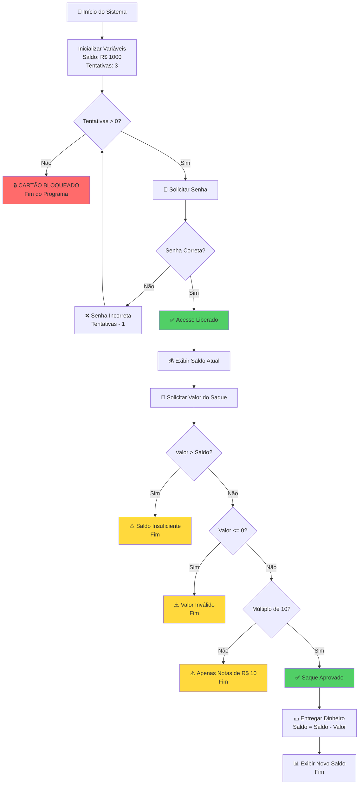

# 🏦 Documentação Técnica - Sistema de Caixa Eletrônico Seguro

## 📋 Introdução

Este documento apresenta a solução completa para o sistema de Caixa Eletrônico com autenticação e validações de segurança. O sistema foi desenvolvido para garantir a integridade das operações bancárias através de múltiplas camadas de validação.

**Contexto do Projeto:** Sistema solicitado pelo CEO para corrigir urgentemente as falhas de segurança no caixa eletrônico, implementando controle de acesso e validações rigorosas de saque.

---

## 🎯 Requisitos do Sistema

**Regras de Negócio:**
- Saldo inicial: R$ 1.000,00
- Senha correta: `9999`
- Tentativas permitidas: 3
- Bloqueio automático após esgotamento de tentativas

**Validações de Saque:**
1. Valor não pode exceder o saldo disponível
2. Valor deve ser positivo (maior que zero)
3. Valor deve ser múltiplo de 10 (notas disponíveis)

---

## 📊 Fluxograma do Sistema



---

## 💻 Código Fonte - Solução Completa

```javascript
// Importar biblioteca nativa para leitura de entrada do terminal
const readline = require('readline').createInterface({
    input: process.stdin,
    output: process.stdout
});

// Função auxiliar para fazer perguntas no terminal
function pergunta(texto) {
    return new Promise((resolve) => {
        readline.question(texto, (resposta) => {
            resolve(resposta);
        });
    });
}

// ========================================
// FUNÇÃO PRINCIPAL DO CAIXA ELETRÔNICO
// ========================================
async function caixaEletronico() {
    console.log("=".repeat(50));
    console.log("🏦  BEM-VINDO AO BANCO SEGURO");
    console.log("=".repeat(50));
    console.log();

    // ========================================
    // 1️⃣ VARIÁVEIS INICIAIS DO SISTEMA
    // ========================================
    let saldo = 1000;              // Saldo inicial da conta
    const senhaCorreta = "9999";   // Senha cadastrada no sistema
    let tentativas = 3;            // Número de tentativas permitidas
    let acessoLiberado = false;    // Flag de controle de autenticação

    // ========================================
    // 2️⃣ LOOP DE AUTENTICAÇÃO (Senha)
    // ========================================
    // ENQUANTO tiver tentativas E o acesso NÃO for liberado
    while (tentativas > 0 && acessoLiberado === false) {
        
        // Solicitar senha ao usuário
        let senhaDigitada = await pergunta(`🔐 Digite sua senha (${tentativas} tentativa(s) restante(s)): `);

        // DECISÃO: Verificar se a senha está correta
        if (senhaDigitada === senhaCorreta) {
            console.log("✅ Senha Correta! Acesso Liberado.\n");
            acessoLiberado = true; // Libera o acesso e SAI do loop
        } 
        else {
            tentativas = tentativas - 1; // Decrementa uma tentativa
            
            if (tentativas > 0) {
                console.log(`❌ Senha Incorreta. Você ainda tem ${tentativas} tentativa(s).\n`);
            }
        }
    }

    // ========================================
    // 3️⃣ VERIFICAÇÃO PÓS-AUTENTICAÇÃO
    // ========================================
    // Se NÃO conseguiu se autenticar (esgotou tentativas)
    if (acessoLiberado === false) {
        console.log("=".repeat(50));
        console.log("🔒 CARTÃO BLOQUEADO POR SEGURANÇA!");
        console.log("📞 Procure seu gerente ou ligue para o banco.");
        console.log("=".repeat(50));
        readline.close(); // Fecha a interface de leitura
        return; // ENCERRA o programa (não executa o resto)
    }

    // ========================================
    // 4️⃣ OPERAÇÃO DE SAQUE (Só chega aqui se autenticou)
    // ========================================
    
    // Exibir saldo atual
    console.log("=".repeat(50));
    console.log(`💰 Saldo Disponível: R$ ${saldo.toFixed(2)}`);
    console.log("=".repeat(50));
    console.log();

    // Solicitar valor do saque
    let valorSaqueTexto = await pergunta("💵 Digite o valor que deseja sacar: R$ ");
    let valorSaque = parseFloat(valorSaqueTexto); // Converte texto para número

    console.log();
    console.log("⏳ Processando operação...\n");

    // ========================================
    // 5️⃣ VALIDAÇÕES DE SEGURANÇA (Ninho de IFs)
    // ========================================
    
    // VALIDAÇÃO 1: Verificar se o valor é maior que o saldo
    if (valorSaque > saldo) {
        console.log("⚠️  ERRO: Saldo Insuficiente.");
        console.log(`📊 Você tem apenas R$ ${saldo.toFixed(2)} disponível.`);
    } 
    // VALIDAÇÃO 2: Verificar se o valor é negativo ou zero
    else if (valorSaque <= 0) {
        console.log("⚠️  ERRO: Valor Inválido.");
        console.log("📌 O valor deve ser maior que zero.");
    } 
    // VALIDAÇÃO 3: Verificar se o valor é múltiplo de 10
    else if (valorSaque % 10 !== 0) {
        // O operador % (módulo) retorna o RESTO da divisão
        // Se o resto da divisão por 10 for diferente de zero, NÃO é múltiplo
        console.log("⚠️  ERRO: Valor Incompatível com as Notas Disponíveis.");
        console.log("💵 Este caixa só possui notas de R$ 10.");
        console.log("📌 Digite um valor múltiplo de 10 (ex: 10, 20, 50, 100...).");
    } 
    // ✅ TODAS AS VALIDAÇÕES PASSARAM - SAQUE APROVADO
    else {
        saldo = saldo - valorSaque; // Subtrai o valor do saldo
        
        console.log("=".repeat(50));
        console.log("✅ SAQUE REALIZADO COM SUCESSO!");
        console.log("=".repeat(50));
        console.log("💵 Tchuk tchuk tchuk... Dinheiro entregue!");
        console.log(`💰 Novo Saldo: R$ ${saldo.toFixed(2)}`);
        console.log("=".repeat(50));
    }

    console.log();
    console.log("🙏 Obrigado por usar o Banco Seguro!");
    console.log("=".repeat(50));
    
    readline.close(); // Fecha a interface de leitura
}

// ========================================
// 🚀 EXECUTAR O PROGRAMA
// ========================================
caixaEletronico();
```

---

## 🎓 Conceitos de Programação Utilizados

### 1. **Variáveis e Tipos de Dados**
- `let`: Para variáveis que mudam de valor
- `const`: Para valores constantes (senha correta)
- `boolean`: Flag de controle (`acessoLiberado`)

### 2. **Estruturas de Controle**

**Loop While:**
```javascript
while (tentativas > 0 && acessoLiberado === false) {
    // Repete ENQUANTO tiver tentativas E não estiver autenticado
}
```

**Estrutura If/Else:**
```javascript
if (condicao1) {
    // Executa se condição 1 for verdadeira
} else if (condicao2) {
    // Executa se condição 2 for verdadeira
} else {
    // Executa se nenhuma condição anterior for verdadeira
}
```

### 3. **Operadores Importantes**

**Operador Módulo (%):**
```javascript
valorSaque % 10 !== 0
// Verifica se NÃO é múltiplo de 10
// Exemplo: 25 % 10 = 5 (resto da divisão)
//          20 % 10 = 0 (múltiplo perfeito)
```

**Operadores Lógicos:**
- `&&` - E (AND): Ambas condições devem ser verdadeiras
- `===` - Igualdade estrita
- `!==` - Diferente de

### 4. **Async/Await**
Permite esperar a entrada do usuário antes de continuar a execução.

---

## 🚀 Como Executar o Sistema

**Passo 1:** Salve o código em um arquivo chamado `caixa_eletronico.js`

**Passo 2:** Abra o terminal na pasta do arquivo

**Passo 3:** Execute o comando:
```bash
node caixa_eletronico.js
```

**Passo 4:** Interaja com o sistema digitando a senha e o valor do saque

---

## 🧪 Cenários de Teste

### ✅ Cenário 1: Saque Bem-Sucedido
- **Senha:** 9999
- **Valor:** 200
- **Resultado:** Saldo final de R$ 800,00

### ❌ Cenário 2: Bloqueio por Senha Incorreta
- **Tentativa 1:** 1234 (Errado - 2 tentativas restantes)
- **Tentativa 2:** 5678 (Errado - 1 tentativa restante)
- **Tentativa 3:** 0000 (Errado - Cartão Bloqueado)

### ⚠️ Cenário 3: Valor Não Múltiplo de 10
- **Senha:** 9999
- **Valor:** 125
- **Resultado:** Erro - Apenas notas de R$ 10

### ⚠️ Cenário 4: Saldo Insuficiente
- **Senha:** 9999
- **Valor:** 1500
- **Resultado:** Erro - Saldo insuficiente

### ⚠️ Cenário 5: Valor Negativo ou Zero
- **Senha:** 9999
- **Valor:** -50 ou 0
- **Resultado:** Erro - Valor inválido

---

## 📚 Conceitos de "Olhar para o Futuro"

Este projeto demonstra habilidades fundamentais para o mercado de trabalho:

1. **Segurança:** Autenticação com limite de tentativas
2. **Validação de Dados:** Múltiplas camadas de verificação
3. **Experiência do Usuário:** Mensagens claras e informativas
4. **Código Limpo:** Comentários e estruturação lógica
5. **Tratamento de Erros:** Prevenção de operações inválidas
6. **Async/Await:** Programação assíncrona moderna
7. **Boas Práticas:** Código legível e manutenível

---

## 🔍 Análise do Código Original vs. Solução

### ❌ Problema no Código Original:
```javascript
let senhaDigitada = "9999"; // Valor fixo - não interage com usuário
let valorSaque = 250;       // Valor fixo - não interage com usuário
```

### ✅ Solução Implementada:
```javascript
let senhaDigitada = await pergunta(`🔐 Digite sua senha...`);
let valorSaqueTexto = await pergunta("💵 Digite o valor...");
```

**Diferença:** O código original era apenas uma simulação. A solução permite interação real com o usuário através do terminal.

---

## 👨‍💻 Desenvolvido para Fins Educacionais

**Propósito:** Documentação Técnica - Banco Seguro  
**Data:** Fevereiro de 2026  
**Linguagem:** JavaScript (Node.js)  
**Objetivo:** Ensino de Lógica de Programação e "Olhar para o Futuro"

---

## 💡 Desafios de Extensão (Opcional)

Para alunos que desejam ir além:

1. **Implementar múltiplos saques:** Permitir que o usuário faça vários saques até zerar o saldo
2. **Histórico de transações:** Guardar um array com todos os saques realizados
3. **Depósito:** Adicionar funcionalidade de depósito
4. **Validação de CPF:** Adicionar validação de CPF antes da senha
5. **Timeout de sessão:** Adicionar um tempo limite para operações

---

*"A lógica de programação é a base de todas as soluções tecnológicas. Domine os fundamentos e você poderá criar qualquer coisa."*

---

## 📞 Suporte

Para dúvidas sobre este projeto educacional, consulte seu instrutor ou revisite os conceitos fundamentais de:
- Estruturas de repetição (while)
- Estruturas condicionais (if/else)
- Operadores lógicos e aritméticos
- Programação assíncrona em JavaScript
